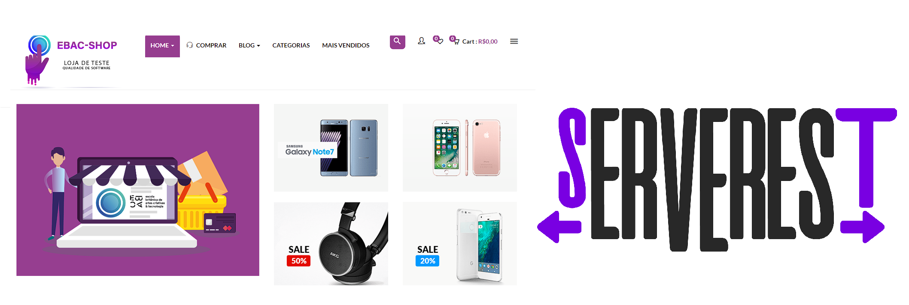
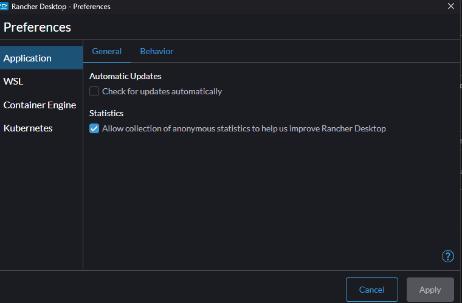
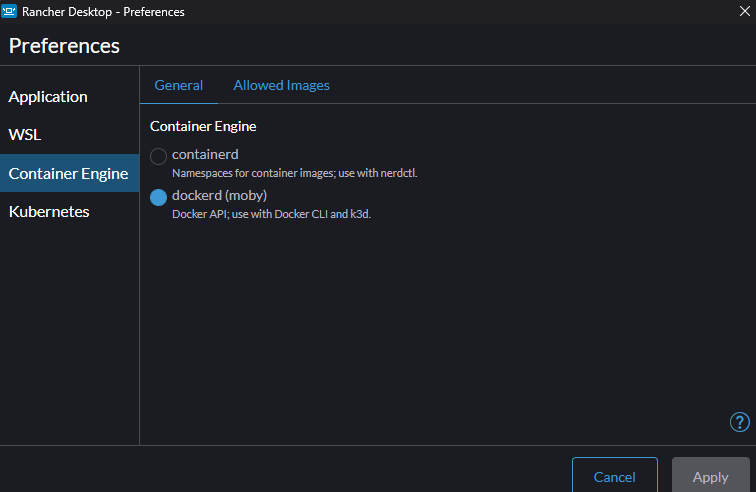
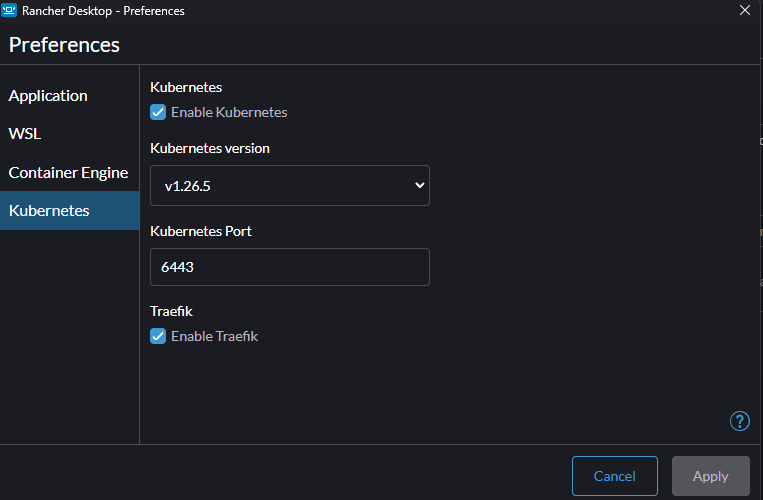

<h1 align="center">Exercício EBAC Testes de API e GUI</h1>

<p align="center"></p>

--------

## Configurando o Ambiente :gear

- [Cypress.io](http://www.cypress.io)

- [Documentação Cypress](https://docs.cypress.io/guides/overview/why-cypress.html)

### Requisitos para instalação

- [Node.js](https://nodejs.org/en/)
- [Java 8 ou superrior caso use o Allure Report](https://javadl.oracle.com/webapps/download/AutoDL?BundleId=244036_89d678f2be164786b292527658ca1605)

### Instalação do NPM e instalação do Cypress

Na pasta do projeto abra o terminal ou no VSCode use o Ctrl + ' (aspas simples), e digite os comandos abaixo:

```shell
npm init -y
npm install --yes
npm install cypress@12.17.3 -d
```

### Comandos para iniciar o Cypress :gear

#### Iniciar o Cypress no navegador

```shell
   npx cypress open
```

#### Para executar em modo headless

```shell
   npx cypress run
```

### Testes de API

#### Instalação da ferramenta Rancher Desktop, para gerenciamento do container API ServRest

Baixe preferencialmente a versão 1.8.1, pois tenho certeza de ser uma versão estável.

- [Versão Rancher Desktop 1.8.1](https://github.com/rancher-sandbox/rancher-desktop/releases/download/v1.8.1/Rancher.Desktop.Setup.1.8.1.msi)

#### Instale normalmente o Rancher Desktop, após isso realize a seguinte configuração

#### Passo 1 - Desmarcar atualização automática

<p align="center"></p>

#### Passo 2 - Configurar o Rancher Desktop para usar o Docker CLI

<p align="center"></p>

#### Passo 3 - Usar a versãoestável do Kubernetes

<p align="center"></p>

Após realizar estas configurações, certifique-se que o Rancher Desktop esteja rodando

### Criando container API ServRest e executando localmente

```
docker run -p 3000:3000 paulogoncalvesbh/serverest:latest
```

- Após ter criado a cópia para executar o ServRest localmente, pode acessar localmente o endereço <http://localhost:3000>
